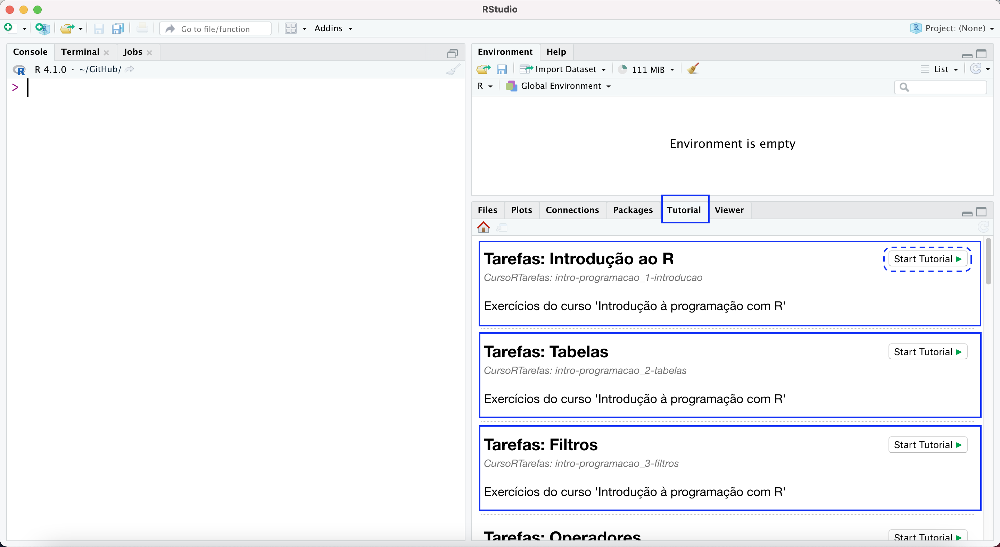

<!-- README.md is generated from README.Rmd. Please edit that file -->

```{r, include = FALSE}
knitr::opts_chunk$set(
  collapse = TRUE,
  comment = "#>",
  fig.path = "man/figures/README-",
  out.width = "100%"
)
```

# CursoRTarefas

<!-- badges: start -->
[](https://lifecycle.r-lib.org/articles/stages.html#experimental)
<!-- badges: end -->

Este pacote armazena as tarefas de alguns cursos da Curso-R.

## Instalação

Para instalar o pacote, execute o código abaixo:

``` r
# install.packages("remotes")
remotes::install_github("curso-r/CursoRTarefas")
```

Após a instalação, é possível acessar as tarefas através do painel `Tutorial` na IDE RStudio, escolhendo o tutorial e clicando em `Start Tutorial` (o tutorial será aberto no RStudio):

```{r echo=FALSE}

```

Outra forma de acessar as tarefas é utilizando a seguinte função (o tutorial será aberto no navegador):

```{r eval=FALSE, include=TRUE}
learnr::run_tutorial("intro-programacao_1-introducao", # id do tutorial
                     package = "CursoRTarefas")
```


## Tarefas disponíveis

```{r echo=FALSE}
library(magrittr, include.only = "%>%")
list.files(path = "inst/tutorials/") %>%
  tibble::as_tibble() %>%
  tidyr::separate(value,
                  into = c("curso", "tarefa"),
                  "_",
                  remove = FALSE) %>%
  dplyr::rename("id_tutorial" = value) %>%
  knitr::kable()
```

